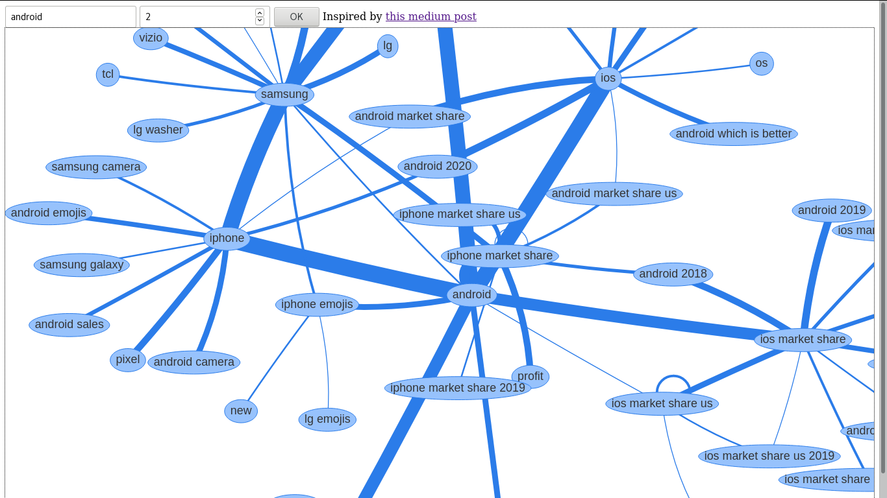
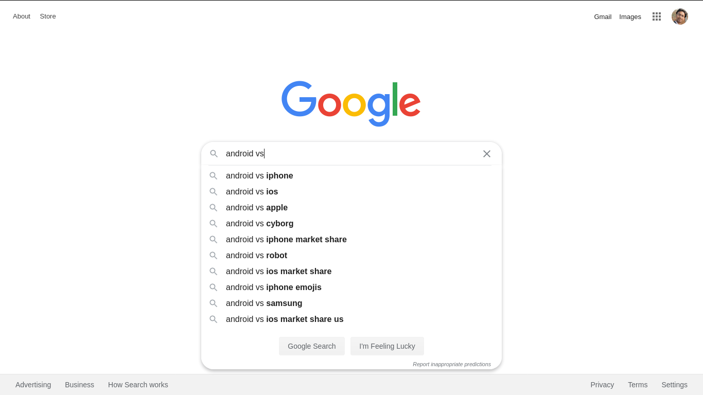

# Knowledge Graph

This tool build a knowledge graph for any given search term. Using the knowledge graph one can navigate related search terms and even discover new relationships between terms.

The tool was inspired by [this medium post](https://medium.com/applied-data-science/the-google-vs-trick-618c8fd5359f).

You can play around with this tool [here](https://discover.abhijitsinha.tech/)

## Pre requisite

* Node
* NPM

## Installing

* clone the repository
* run `npm install` inside the repository

## Running

* run `npm run build`

## Using

* Goto [localhost:3000](http://localhost:3000/)
* In the first text box add a search term whose knowledge graph you want to build
* In the second text box enter the depth of search for the knowledge graph (defaults to 0 and gives the immediate connections)

**NOTE**: higher value of search depth results in larger knowledge graph and therefore slower search result.

## How it works

This depends on the google's 'vs' autocompletion. In the google search bar when you enter `<search term> vs`, google tries to guess the best term that would fit the complete search.

This tool iteratively searches for all the related auto complete terms and builds the complete graph. The weight of each edge depends on the ranking of the auto complete provided by google.
